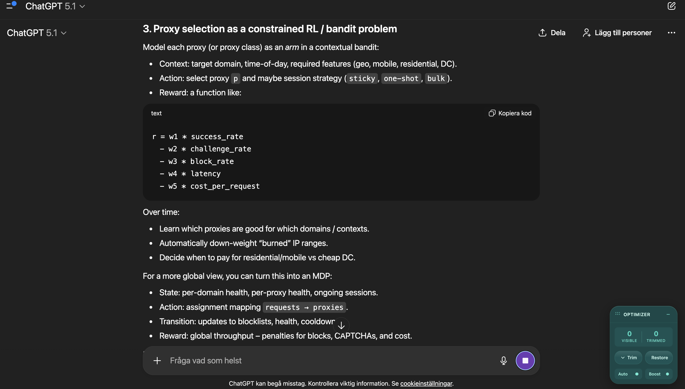
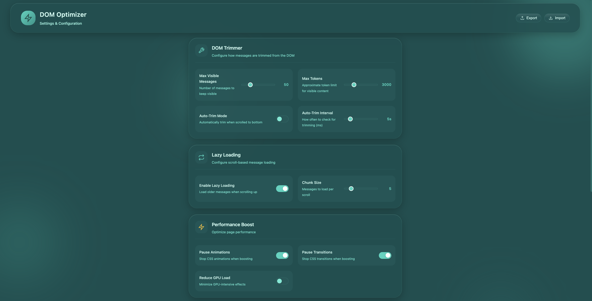
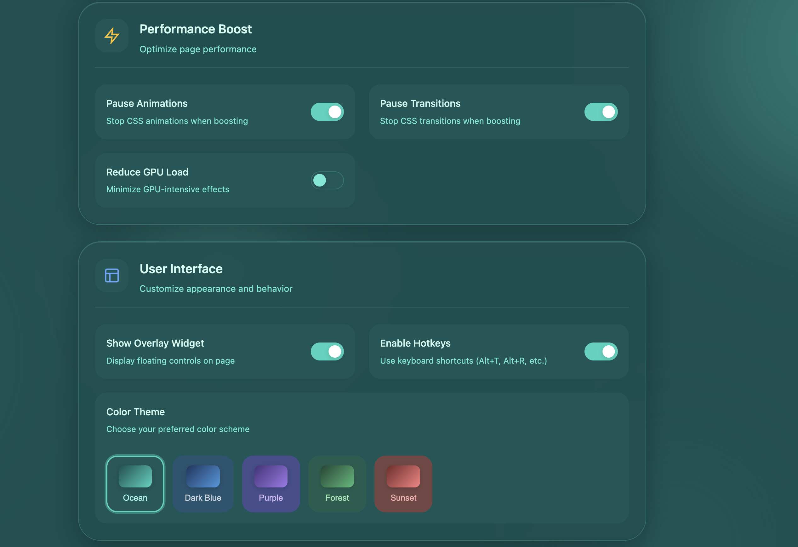

# DOM Performance Optimizer

browser extension that fixes slow ai chat interfaces.

long conversations in chatgpt, claude, grok, perplexity, and gemini cause massive browser lag. the page tries to render thousands of dom nodes and everything slows down. this extension trims old messages from the dom while keeping them in memory. scroll up and they lazy load back. nothing is lost.



## features

**dom trimming** removes old messages from the rendered page to reduce memory usage and improve scroll performance. messages stay in memory and can be restored instantly.

**lazy loading** automatically loads older messages in chunks when you scroll up. adjusts chunk size based on scroll speed.

**performance boost** pauses css animations and transitions. applies will change and contain hints to reduce layout thrashing and gpu load.

**auto trim** keeps the dom light automatically when youre at the bottom of the conversation. pauses when you scroll up to browse history.

**keyboard shortcuts** alt+t to trim, alt+r to restore, alt+a for auto mode, alt+p for performance boost.

## supported sites

- chatgpt (chat.openai.com, chatgpt.com)
- claude (claude.ai)
- grok (grok.x.ai, x.com/i/grok)
- perplexity (perplexity.ai)
- gemini (gemini.google.com)
- generic fallback for other sites

## installation

1. clone this repo or download as zip
2. go to `chrome://extensions` or `brave://extensions`
3. enable developer mode
4. click load unpacked
5. select the folder

no build step. no dependencies. just load and use.

## screenshots





## usage

click the extension icon to open controls. use the slider to set how many messages to keep visible. lower values mean better performance.

**trim dom** removes old messages immediately

**restore all** brings everything back

**free memory** clears offscreen images and pauses background videos

**purge cache** clears extension storage

## settings

right click the extension icon and select options to configure:

- max visible messages
- auto trim interval
- lazy load chunk size
- performance optimizations
- color theme
- overlay visibility

settings can be exported and imported as json.

## how it works

the extension uses site specific adapters to identify message elements in each chat interface. when you trim, it removes dom nodes and stores references in a map. restoration reinjects nodes in the correct order.

the lazy loader monitors scroll position and loads chunks of messages as you approach the top. chunk size adjusts dynamically based on scroll velocity.

performance boost injects css that disables animations and applies containment properties to prevent unnecessary reflows.

## technical details

- manifest v3
- service worker background
- content scripts for dom manipulation
- chrome.storage.local for settings
- no external requests
- no analytics
- no tracking

## file structure

```
manifest.json
background.js
content/
  content.js
  dom-trimmer.js
  lazy-loader.js
  performance-boost.js
  site-detector.js
  site-adapters/
popup/
options/
overlay/
styles/
utils/
```

## browser support

chrome, brave, edge, and chromium based browsers.

## contributing

pull requests welcome. to add support for a new site, create an adapter in `content/site-adapters/` extending the base adapter class.

## license

mit
